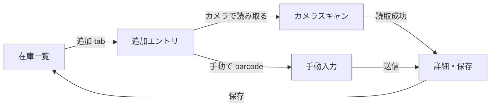
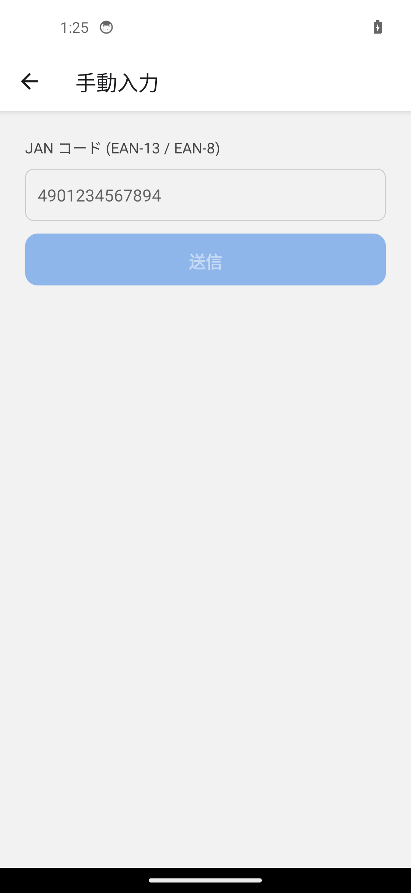
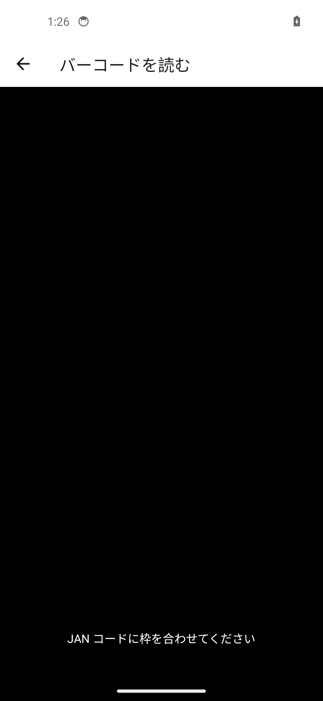
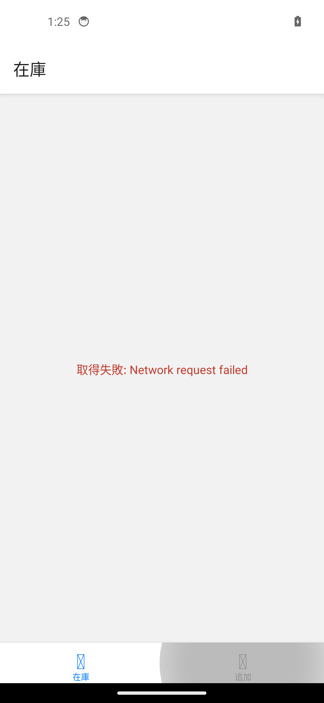

# As-Is Screen Catalog

> このファイルは `bun run --filter @prep-hamster/mobile capture` で生成される。
> 手動編集する場合は再生成で上書きされる前提。

## 画面遷移 (現状)

## キャプチャ

### add-manual-after-submit

### add-manual-input-filled

### add-manual-input

### add-scan-permission-or-camera

### home-add-entry

### home-stocks-list

## 実行手順

1. Android emulator を起動 (Android Studio / `emulator -avd <name>`)
2. `bun run --filter @prep-hamster/mobile android` で app をビルド & インストール
3. `bun run --filter @prep-hamster/mobile capture` で flow 実行 + キャプチャ取得
