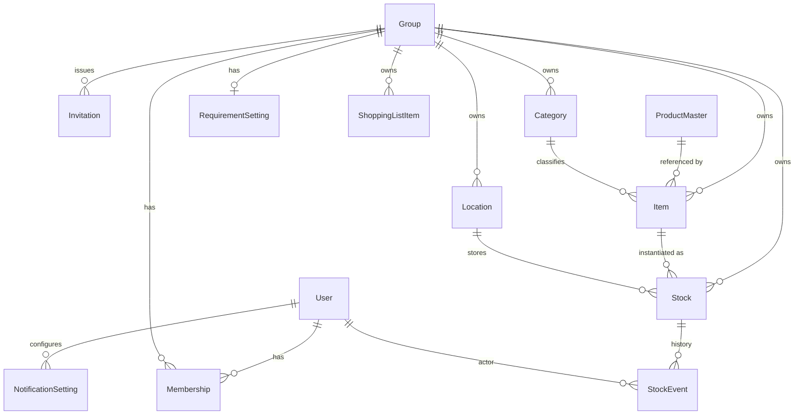

# データモデル設計 v1.0.0

> 本書は requirements.md v1.0.0 を満たすための **How**（永続化されるデータ構造）を扱う。
> flow（流動）ドキュメント扱い。スキーマ確定後に必要な部分は `docs/stock/` 配下へ移す。

## 1. 設計方針

- **スキーマファースト**: 本書で定義したエンティティ・フィールドを正として、実装（DB マイグレーション・型・API スキーマ）を従わせる。
- **論理削除**: ユーザーデータの保護および同期競合解決のため、削除は `deletedAt` で表現する。物理削除は GC ポリシーで別途扱う。
- **タイムスタンプ**: 全エンティティに `createdAt` / `updatedAt` を持たせ、`updatedAt` は同期判定の基礎に使う。
- **ローカルファースト同期**: クライアントは UUID を自前生成し、サーバとの同期前に楽観的にローカル反映する。サーバはサーバ側 `serverUpdatedAt` を別途持たせる。
- **マルチテナンシー**: ユーザーデータ系のレコードは `groupId` を持ち、グループ間で論理分離する。`ProductMaster` のみ全グループ横断のグローバル参照テーブル。
- **アペンドオンリーな履歴**: 在庫の変動は `Stock` 本体の更新と並行して `StockEvent` に追記し、分析・監査に使う。
- **JAN は SKU 識別子として扱う**: 内容量・パッケージ違いは別 SKU = 別 JAN。`ProductMaster` は JAN を一意キーにする。店舗内コード（`02` / `20-29` 始まり）・生鮮食品の独自コードは `ProductMaster` には登録しない（`Item.barcode` のみ保持）。
- **将来のグループネスト**: v1.0.0 では `Group` をフラットに保つ。`parentGroupId` のような拡張点は v1.0.0 では追加しない（YAGNI）。導入時に専用マイグレーションを行う。

## 2. ER 図

## 3. エンティティ定義

> 全エンティティに `id (uuid)` `createdAt` `updatedAt` `deletedAt (nullable)` を持たせる前提（個別の表からは省略）。

### 3.1 User
| フィールド    | 型        | 必須 | 説明                                       |
| ------------- | --------- | ---- | ------------------------------------------ |
| email         | string    | ✓    | 一意                                       |
| displayName   | string    | ✓    |                                            |
| avatarUrl     | string    |      |                                            |
| locale        | string    |      | i18n の余地（既定 `ja-JP`）                |

### 3.2 Group
| フィールド    | 型     | 必須 | 説明                                  |
| ------------- | ------ | ---- | ------------------------------------- |
| name          | string | ✓    | 例: 「自宅」「実家」                  |
| createdBy     | uuid   | ✓    | User.id                               |

### 3.3 Membership
ユーザーとグループの関係 + 権限。

| フィールド | 型                                  | 必須 | 説明                |
| ---------- | ----------------------------------- | ---- | ------------------- |
| userId     | uuid                                | ✓    |                     |
| groupId    | uuid                                | ✓    |                     |
| role       | enum(`OWNER`,`EDITOR`,`VIEWER`)     | ✓    | RBAC                |
| joinedAt   | datetime                            | ✓    |                     |

制約: `(userId, groupId)` 一意。グループには最低 1 人の OWNER が存在する。

### 3.4 Invitation
| フィールド  | 型                                  | 必須 | 説明                                |
| ----------- | ----------------------------------- | ---- | ----------------------------------- |
| groupId     | uuid                                | ✓    |                                     |
| inviterId   | uuid                                | ✓    | User.id                             |
| role        | enum(`OWNER`,`EDITOR`,`VIEWER`)     | ✓    | 招待時に付与する権限                |
| token       | string                              | ✓    | 一意・難読化                        |
| expiresAt   | datetime                            | ✓    |                                     |
| usedAt      | datetime                            |      | 使い切り判定                        |
| usedBy      | uuid                                |      | User.id                             |

### 3.5 Location
グループ内の保管場所。

| フィールド | 型     | 必須 | 説明                                      |
| ---------- | ------ | ---- | ----------------------------------------- |
| groupId    | uuid   | ✓    |                                           |
| name       | string | ✓    | 例: 「キッチン上戸棚」「備蓄ボックス A」  |
| sortOrder  | int    |      | 表示順                                    |

### 3.6 Category
グループ内のカテゴリ。

| フィールド  | 型     | 必須 | 説明                            |
| ----------- | ------ | ---- | ------------------------------- |
| groupId     | uuid   | ✓    |                                 |
| name        | string | ✓    | 例: 「水」「主食」「日用品」    |
| sortOrder   | int    |      |                                 |

### 3.7 ProductMaster
グローバル横断の SKU 商品マスタ。JAN コードを一意キーにし、外部 JAN API の取得結果やユーザー手入力からの昇格でレコードが蓄積される。**読み取り中心のテーブル**で、書き込みはサーバ側のみ（クライアントは検索のみ）。

| フィールド       | 型                                                | 必須 | 説明                                                                |
| ---------------- | ------------------------------------------------- | ---- | ------------------------------------------------------------------- |
| jan              | string                                            | ✓    | 13 桁 / 8 桁。グローバル一意                                        |
| name             | string                                            | ✓    | 例: 「コカ・コーラ ペットボトル 500ml」                             |
| manufacturer     | string                                            |      |                                                                     |
| brand            | string                                            |      |                                                                     |
| contentAmount    | number                                            |      | 内容量                                                              |
| contentUnit      | string                                            |      | `ml` / `g` / `個` など                                              |
| categoryHint     | string                                            |      | 自動カテゴリ推測のヒント（外部 API のカテゴリ等）                   |
| imageUrl         | string                                            |      |                                                                     |
| source           | enum(`YAHOO_SHOPPING`, `RAKUTEN_ICHIBA`, `JANCODE_LOOKUP`, `GS1_JICFS`, `OTHER`) | ✓    | レコードの出所。候補と採用方針は `jan-api-candidates.md` 参照。`MANUAL` は v1.0.0 では用意しない |
| sourceRaw        | json                                              |      | 取得元の生レスポンス（再ビルド・差分検知用）                        |
| fetchedAt        | datetime                                          | ✓    |                                                                     |
| confidence       | enum(`HIGH`, `MEDIUM`, `LOW`)                      |      | 出所信頼度（複数 API の合議や手入力昇格の評価用）                   |

制約:
- `jan` は一意（部分インデックスではなく完全一意制約）。
- 店舗内コード（`02` / `20-29` 始まり）は `ProductMaster` に登録しない。`Item.barcode` 側に閉じて保持する。
- 同一 JAN が複数 source から得られた場合は最新 / 高 confidence で上書き。`sourceRaw` には全ソースの履歴を残す方針も将来検討（v1.0.0 では最新 1 件で良い）。
- **v1.0.0 では `ProductMaster` への書き込みは外部 JAN API 経由のみ**。ユーザー手入力分は `Item` 止まりで、`ProductMaster` には昇格しない（コミュニティ昇格による誤情報混入を避けるため）。

### 3.8 Item
グループ内の商品エイリアス。`ProductMaster` を参照しつつ、グループ独自の表示名・カテゴリ割り当て・備考をオーバーライドできる。

| フィールド        | 型     | 必須 | 説明                                                                                |
| ----------------- | ------ | ---- | ----------------------------------------------------------------------------------- |
| groupId           | uuid   | ✓    |                                                                                     |
| productMasterId   | uuid   |      | `ProductMaster.id`。JAN ヒット時に紐付け                                            |
| name              | string | ✓    | グループ内表示名。初期値は `ProductMaster.name`                                     |
| barcode           | string |      | JAN / EAN / 店舗内コード（オフライン登録・店舗内コード等で `productMasterId` 不在時のため冗長保持） |
| categoryId        | uuid   |      | グループ内 `Category.id`                                                            |
| defaultUnit       | string |      | 「個」「本」「g」など                                                               |
| manufacturer      | string |      | 表示用オーバーライド                                                                |
| memo              | string |      |                                                                                     |

制約:
- `(groupId, productMasterId)` は `productMasterId` が NOT NULL のとき一意（同じ SKU を同じグループに重複登録しない）。
- `(groupId, barcode)` は `productMasterId` が NULL かつ `barcode` が NOT NULL のとき一意（店舗内コード等のローカル一意性）。

#### 採用方針: ProductMaster + Item（v1.0.0 確定）
- v1.0.0 から `ProductMaster` を導入する（前回の「将来送り」判断を撤回）。理由は requirements.md 4.3 で JAN ベースの商品詳細自動取得を MUST にしたため。
- `Item` は引き続きグループ単位だが、`productMasterId` で SKU マスタを参照する。同じ JAN を別グループで読んでも初期値（商品名・メーカー・内容量）が揃う。
- `Item.barcode` を冗長保持する理由:
    - **オフライン登録**: スキャン時に `ProductMaster` 同期前でもローカルに JAN を保存できる。
    - **店舗内コード**: `02` / `20-29` 系は `ProductMaster` に登録しないため、`Item.barcode` のみ持つ。
- 外部 JAN API の選定（Yahoo!ショッピング検索 / 楽天商品検索 / その他）は v1.0.0 の未確定事項。`ProductMaster.source` で抽象化されているため、後から差し替え・並列化が可能。

### 3.9 Stock
在庫の実体。1 件 = 同一商品・同一場所・同一期限のロット。

| フィールド       | 型     | 必須 | 説明                                                |
| ---------------- | ------ | ---- | --------------------------------------------------- |
| groupId          | uuid   | ✓    |                                                     |
| itemId           | uuid   | ✓    | Item.id                                             |
| locationId       | uuid   | ✓    | Location.id                                         |
| quantity         | number | ✓    | 残量                                                |
| unit             | string | ✓    | Item.defaultUnit を継承（変更可）                   |
| useByDate        | date   |      | 消費期限                                            |
| bestBeforeDate   | date   |      | 賞味期限                                            |
| openedAt         | date   |      | 開封日（任意）                                      |
| note             | string |      |                                                     |

制約:
- `useByDate` と `bestBeforeDate` は両方 NULL を許容（非食品向け）。少なくとも一方を入力するよう UI で推奨。
- `quantity >= 0`。`0` になったら `deletedAt` を立てるかは UI 側ポリシー（履歴目的で残すケースあり）。

### 3.10 StockEvent
在庫の変動履歴（アペンドオンリー）。

| フィールド     | 型                                                                                  | 必須 | 説明                                              |
| -------------- | ----------------------------------------------------------------------------------- | ---- | ------------------------------------------------- |
| groupId        | uuid                                                                                | ✓    |                                                   |
| stockId        | uuid                                                                                | ✓    | Stock.id                                          |
| eventType      | enum(`ADD`, `CONSUME`, `DISCARD`, `MOVE`, `EDIT`)                                    | ✓    |                                                   |
| quantityDelta  | number                                                                              | ✓    | 増減量（`ADD` は正、`CONSUME`/`DISCARD` は負）    |
| fromLocationId | uuid                                                                                |      | `MOVE` 用                                         |
| toLocationId   | uuid                                                                                |      | `MOVE` 用                                         |
| occurredAt     | datetime                                                                            | ✓    |                                                   |
| actorUserId    | uuid                                                                                | ✓    | User.id                                           |
| reason         | string                                                                              |      | 廃棄理由など（例: `EXPIRED` / `SPOILED`）         |

制約: `StockEvent` は更新・削除しない（アペンドオンリー）。

### 3.11 RequirementSetting
グループ単位の必要備蓄量設定。

| フィールド            | 型                          | 必須 | 説明                                                |
| --------------------- | --------------------------- | ---- | --------------------------------------------------- |
| groupId               | uuid                        | ✓    | 一意（1 グループ 1 件）                             |
| peopleCount           | int                         | ✓    |                                                     |
| days                  | int                         | ✓    |                                                     |
| perCategorySettings   | json                        |      | `{ categoryId: { minQuantity, unit, coefficient } }` |

### 3.12 ShoppingListItem
| フィールド       | 型                                  | 必須 | 説明                                                  |
| ---------------- | ----------------------------------- | ---- | ----------------------------------------------------- |
| groupId          | uuid                                | ✓    |                                                       |
| itemId           | uuid                                |      | 既存 Item から（任意）                                |
| name             | string                              | ✓    | itemId 未指定時のフリーテキスト                       |
| quantity         | number                              | ✓    | 必要数量                                              |
| unit             | string                              |      |                                                       |
| source           | enum(`AUTO`, `MANUAL`)              | ✓    | 必要量算出由来 / 手動追加                             |
| status           | enum(`OPEN`, `BOUGHT`, `CANCELLED`) | ✓    |                                                       |
| addedBy          | uuid                                | ✓    | User.id                                               |

### 3.13 NotificationSetting
| フィールド                 | 型                                  | 必須 | 説明                                              |
| -------------------------- | ----------------------------------- | ---- | ------------------------------------------------- |
| userId                     | uuid                                | ✓    |                                                   |
| expiringNotifyEnabled      | boolean                             | ✓    | 期限近接通知の ON/OFF                             |
| expiringDaysBefore         | int                                 | ✓    | 既定 7                                             |
| expiredNotifyEnabled       | boolean                             | ✓    |                                                   |
| shortageNotifyEnabled      | boolean                             | ✓    |                                                   |
| invitationNotifyEnabled    | boolean                             | ✓    |                                                   |
| pushToken                  | string                              |      | デバイスごとの push 受信用トークン                |

## 4. 同期・競合解決

### 4.1 識別子
- 全 PK は **クライアント生成 UUID v4**。サーバ生成を待たずにローカル反映できる。

### 4.2 タイムスタンプ
- レコードは `updatedAt` をクライアント時計で更新。サーバ受信時に `serverUpdatedAt` を別フィールドで保持。
- 同期判定は `serverUpdatedAt` で、競合解決は `updatedAt` で行う。

### 4.3 競合解決ポリシー（v1.0.0 既定）

> 用語: **LWW = Last-Write-Wins**（最終更新優先）。同じレコードに対する並行更新があった場合、`updatedAt` がより新しい方を採用するシンプルな競合解決方式。実装が単純な反面、片方の変更が消える可能性がある。

| エンティティ                               | ポリシー                                                                  |
| ------------------------------------------ | ------------------------------------------------------------------------- |
| `Stock`（数量）                            | LWW（`updatedAt` で比較）                                                 |
| `StockEvent`                               | アペンドオンリーのため競合しない（重複検知はクライアント生成 UUID で）    |
| マスタ系（`Item`, `Category`, `Location`） | LWW                                                                       |
| `ProductMaster`                            | サーバ権威。クライアントは pull のみ                                      |
| `Membership` / `Invitation`                | サーバ権威。クライアントは差分を pull のみ                                |

#### 採用方針: LWW + StockEvent 二重持ち（v1.0.0 確定）
- v1.0.0 では `Stock.quantity` を直接更新（LWW）し、並行して `StockEvent` を追記する二重持ちで進める。
- 理由:
    - 備蓄管理アプリでは同一在庫の同時編集頻度が低く、LWW で実害が出るケースが稀。実装・SDK / ORM サポートも単純で短期に出せる。
    - イベントソーシング（`StockEvent` のみを真実の源とし、Stock を再計算する方式）は競合解決に強い反面、初期実装コストとデバッグコストが高く v1.0.0 では過剰。
- 将来の出口戦略: `StockEvent` をアペンドオンリーで残しているため、競合や不整合が運用で問題化したら Stock を view 化（再計算）する移行が可能。順序付けに必要なクライアント時計補正（Lamport timestamp / HLC = Hybrid Logical Clock）はそのフェーズで導入する。

### 4.4 オフラインキュー
- クライアントはオフライン中の変更を `OutboxOperation`（ローカルのみのテーブル）に積む。
- 復旧時に順序を保って送信し、サーバ側で冪等処理する（オペレーション ID を UUID で持つ）。

## 5. インデックス指針（DB レベル）

- `ProductMaster`: `jan`（一意）、`(name)` 全文検索用、`fetchedAt`。
- `Stock`: `(groupId, useByDate)` `(groupId, bestBeforeDate)` `(groupId, locationId)` `(groupId, itemId)`。
- `StockEvent`: `(groupId, occurredAt DESC)` `(stockId, occurredAt DESC)`。
- `Membership`: `(userId)` `(groupId)`。
- `Invitation`: `token`（一意）。
- `Item`: `(groupId, productMasterId)`（部分インデックス: `productMasterId IS NOT NULL`）、`(groupId, barcode)`（部分インデックス: `productMasterId IS NULL AND barcode IS NOT NULL`）。

## 6. データ保持・GC

- `deletedAt` が立ったレコードは 90 日経過後に物理削除候補（v1.0.0 では運用バッチで実施）。
- `StockEvent` は永続保持（容量が問題化したら集計テーブルに集約する v1.x 課題）。

## 7. 未確定事項（次フェーズで詰める）

- 外部 JAN API の選定。第一候補は **Yahoo!ショッピング商品検索 API**（`jan_code` パラメータ対応・無料）。他候補:
    - 楽天商品検索 API
    - JANKEN.jp
    - じゃん検索
    - JANCODE DATABASE
- 並列照会の有無、ヒット率比較、`confidence` 補正ロジック。
- `OutboxOperation` のスキーマ詳細（オペレーション種別の網羅）。
- バックエンドの選定（Supabase / Firebase / 自前 API）と、それに合わせた認証・RLS / セキュリティルール設計。
- 暗号化（at rest / in transit）の具体仕様。

> 解決済み: `ProductMaster` への手入力昇格フローは v1.0.0 では実装しない（外部 API 取得経由のみ書き込み、手入力は `Item` 止まり）。

---

## ステータス・更新履歴

- 2026-05-03: 初版作成（エンティティ定義・ER 図・同期方針）
- 2026-05-03: 商品マスタの粒度を「グループ単位 + 将来 ProductMaster 分離」に確定。同期方式を「LWW + StockEvent 二重持ち」に確定。
- 2026-05-03: requirements.md 4.3 で JAN ベースの商品詳細自動取得を MUST に格上げしたのに合わせ、`ProductMaster` を v1.0.0 から導入する設計に改訂。Item に `productMasterId` 参照を追加。JAN は SKU 単位前提を 1 章に明記。LWW を「Last-Write-Wins」と展開。
- 2026-05-03: `ProductMaster` 書き込みを外部 JAN API 経由のみに確定（手入力は `Item` 止まり）。`source` enum から `MANUAL` を削除。外部 API 候補に Yahoo!ショッピング商品検索（第一候補）／楽天商品検索／JANKEN.jp／じゃん検索／JANCODE DATABASE を列挙。
- 2026-05-03: `jan-api-candidates.md` の調査結果に基づき `source` enum を改訂（`YAHOO_SHOPPING` / `RAKUTEN_ICHIBA` / `JANCODE_LOOKUP` / `GS1_JICFS` / `OTHER`）。公開 API が確認できなかった `JANKEN` / `JAN_SEARCH` / `JANCODE_DB` を除外。
