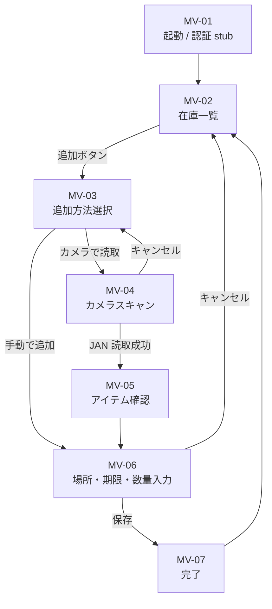
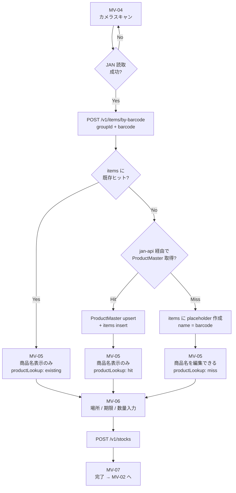
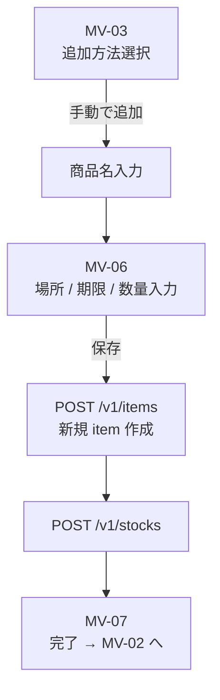

# モバイル MVP フロー v1.0.0（2026-05-05 ピボット版）

> 本書は **2026-05-05 のスコープ縮小** を反映した v1.0.0 ship 用の絞り込みドキュメント。
> 完成形のビジョン（モバイル / Web / CLI 全部入り）は `screen-flow.md` 側を参照。
> 用語・データモデルは `data-model.md` / `glossary.md` と整合させる。

## 1. ピボットの経緯

- 当初: v1.0.0 = API + CLI のみ、モバイル / Web は v1.1.0 以降
- 2026-05-05 ピボット: 「モバイル側を使うタイミングが迫っている」ため、**モバイル MVP** を v1.0.0 に前倒し
- ただしモバイルのスコープは **「在庫追加」の vertical slice** のみに絞る

## 2. v1.0.0 の ship 範囲

### 2.1 IN（必ず入る）

- API + CLI の在庫追加・閲覧（既存方針通り）
- **モバイル MVP**: 在庫追加 + カメラバーコード読取 + 場所/期限入力 + 在庫一覧表示
- 認証は `x-user-id` ヘッダ stub のまま（Supabase Auth 本実装は v1.1.0）

### 2.2 OUT（v1.1.0 以降に持ち越し）

- 在庫の **消費 / 移動 / 廃棄** UI
- 在庫の **検索 / 絞り込み / フィルタ** UI
- グループ作成 / 招待 / メンバー管理の UI
- 通知（push）
- 必要備蓄量・買い物リスト
- 履歴 / グラフ
- Web 管理画面
- モバイル E2E（Playwright Mobile / Detox 等）— 手動確認で OK
- Supabase Auth 本実装

### 2.3 関連 Issue

| Issue | 内容                                               | 優先度                               |
| ----- | -------------------------------------------------- | ------------------------------------ |
| #67   | groups CRUD + owner membership                     | priority/high                        |
| #69   | group authorization middleware                     | priority/high                        |
| #70   | locations / categories CRUD                        | priority/high                        |
| #71   | items CRUD（手動入力）                             | priority/high                        |
| #74   | jan-api package（JAN → ProductMaster）             | priority/high                        |
| #75   | items find-or-create endpoint（バーコード経由）    | priority/high                        |
| #76   | mobile bootstrap（Expo + Expo Router + auth stub） | priority/high                        |
| #77   | 在庫追加画面（カメラ → 場所 → 期限 → 保存）        | priority/high                        |
| #68   | memberships フル管理                               | priority/medium（v1.1.0 持ち越し可） |
| #72   | stocks consume / move / soft-delete                | priority/medium                      |
| #73   | stocks GET-by-id / PATCH / 検索                    | priority/medium                      |

## 3. 画面構成（v1.0.0 ship 分のみ）

| 画面ID | 画面名               | 役割                                                   |
| ------ | -------------------- | ------------------------------------------------------ |
| MV-01  | 起動 / 認証 stub     | `x-user-id` を AsyncStorage から読み出す or 初回固定値 |
| MV-02  | 在庫一覧（ホーム）   | 現在のグループの stock 一覧を表示。追加への導線を持つ  |
| MV-03  | 追加方法選択         | 「カメラで読取」/「手動で追加」                        |
| MV-04  | カメラスキャン       | `expo-camera` で JAN を読み取る                        |
| MV-05  | アイテム確認         | `POST /v1/items/by-barcode` 結果に応じて表示 / 編集    |
| MV-06  | 場所・期限・数量入力 | 保存前の最終フォーム                                   |
| MV-07  | 完了                 | 一覧 (MV-02) へ戻る                                    |

> v1.0.0 ではグループ切替 UI は持たない。固定 1 グループ前提（手動 seed or 初回起動時にデフォルト 1 件作成）。

## 4. 全体遷移図

## 5. バーコード追加フロー（クリティカルパス）

`screen-flow.md` 2.3.1 の三段フォールバックを v1.0.0 ship 範囲に絞った版。

備考:

- v1.0.0 ではローカルキャッシュ層（screen-flow.md 2.3.1 の最初の段）は持たない。**サーバ + 外部 JAN API の二段** に簡略化。オフライン耐性は v1.1.0 で追加。
- 店舗内コード（`02` / `20-29` 始まり）や生鮮独自コードは jan-api で miss するため、placeholder + 手動 name 編集の動線が必要。
- Simulator 等カメラが使えない端末向けに、JAN を手入力する debug 入口を MV-04 に置く。

## 6. 手動追加フロー

備考:

- 手動追加では item を毎回新規作成する。JAN を持たないため `(groupId, barcode)` 検索でヒットしない。
- 既存 item からの追加（同じ商品名で別期限の在庫を足す）は v1.1.0 の検索 UI 整備後に実装する。

## 7. API 呼び出しサマリ

| 画面                | 呼び出し API                        | 依存 Issue                                |
| ------------------- | ----------------------------------- | ----------------------------------------- |
| MV-02               | `GET /v1/stocks?groupId=`           | 既存（main 済）                           |
| MV-04 → MV-05       | `POST /v1/items/by-barcode`         | #75（内部で #74 jan-api を利用）          |
| MV-06（手動）       | `POST /v1/items`, `POST /v1/stocks` | #71, 既存                                 |
| MV-06（バーコード） | `POST /v1/stocks`                   | 既存                                      |
| MV-06 場所セレクタ  | `GET /v1/locations?groupId=`        | #70                                       |
| 全体共通            | groupId 取得                        | #67（fixed default group の seed が必要） |
| 全体共通            | membership 確認                     | #69（middleware）                         |

## 8. 実装順（推奨）

1. **#67** groups CRUD（owner membership 自動作成） — 全 endpoint の前提
2. **#69** group authorization middleware — 以降の endpoint はこれを通す
3. **#70** locations / categories CRUD — MV-06 の場所セレクタが依存
4. **#71** items CRUD（手動） — MV-06 手動フォームが依存
5. **#74** jan-api package — #75 が依存
6. **#75** items find-or-create endpoint — MV-05 が依存
7. **#76** mobile bootstrap（Expo + Router + auth stub + API client） — モバイル土台
8. **#77** 在庫追加画面 — 統合実装

#67 → #69 → (#70, #71 並行可) → #74 → #75 → #76 → #77 がクリティカルパス。

## 9. v1.0.0 から外れたユースケースの扱い

| ユースケース                 | v1.0.0                  | v1.1.0 |
| ---------------------------- | ----------------------- | ------ |
| UC-01 在庫追加（手入力）     | ◎ MV-06                 | —      |
| UC-02 バーコードで追加       | ◎ MV-04 → MV-06         | —      |
| UC-03 消費 / 廃棄            | ×                       | ○      |
| UC-04 場所移動               | ×                       | ○      |
| UC-05 期限通知               | ×                       | ○      |
| UC-06 検索・絞り込み         | ×                       | ○      |
| UC-07 買い物リスト           | ×                       | ○      |
| UC-08〜09 グループ作成・招待 | × （seed のみ）         | ○      |
| UC-10 必要備蓄量             | ×                       | ○      |
| UC-11 グラフ                 | ×                       | ○      |
| UC-12 複数グループ切替       | ×                       | ○      |
| UC-13 CLI import / export    | △ 既存 CLI スコープのみ | ○      |
| UC-14 オフライン参照         | ×                       | ○      |

## 10. 未確定事項

- 初期グループの seed 方針（mobile bootstrap 時に自動作成 or DB seed script で事前準備）。#76 で詰める。
- ProductMaster テーブルの schema 状態（既存有無）。#74 着手時に確認。無ければ追加 PR を分ける。
- カメラ permission の onboarding UI（初回起動時）。#76 / #77 のどちらで実装するか。

---

## ステータス・更新履歴

- 2026-05-05: 初版作成。2026-05-05 ピボット（モバイル MVP を v1.0.0 へ前倒し）を反映した v1.0.0 ship 範囲に絞り込み。
