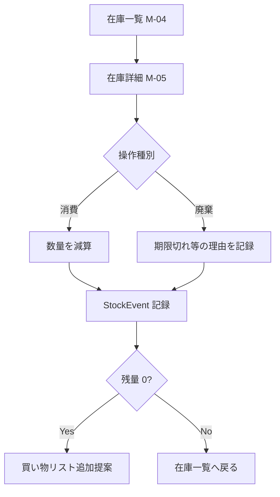
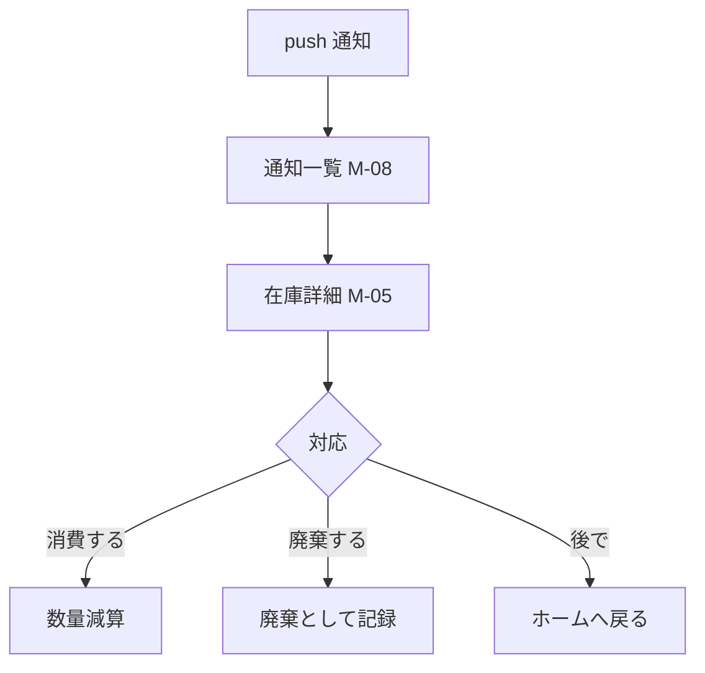
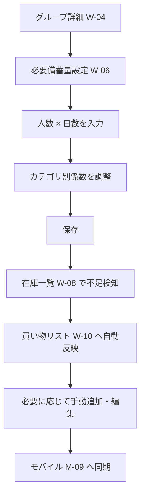

# 画面・操作フロー設計 v1.0.0

> 本書は requirements.md v1.0.0 を満たすための **How**（画面構成・操作フロー）を扱う。
> flow（流動）ドキュメント扱い。仕様確定後に必要なものは `docs/stock/` 配下へ移す。

## 1. 設計方針

### 1.1 プラットフォーム配分（再掲）
| プラットフォーム | 主対象           | 役割                                           |
| ---------------- | ---------------- | ---------------------------------------------- |
| モバイルアプリ   | 一般ユーザー     | 日常動線での在庫操作・通知受信・買い物リスト   |
| Web              | 管理者           | グループ運用・必要量設定・履歴分析・一括操作   |
| CLI              | パワーユーザー   | 一括 import / export・スクリプト連携           |

### 1.2 画面構成上の原則
- 一般ユーザーが最頻繁に行う操作（在庫追加・消費・期限確認）はモバイルのホームから 2 タップ以内で到達できる。
- 管理者操作は Web に寄せ、モバイルでは閲覧と簡易編集に留める。
- グループ切替は全プラットフォームで常時可能（複数グループ所属が前提）。
- オフラインで参照・追記できる画面と、オンライン必須の画面（招待・履歴グラフ等）を明示する。

## 2. モバイルアプリ（一般ユーザー向け）

### 2.1 画面一覧
| 画面ID  | 画面名             | オフライン | 主な機能                                                       |
| ------- | ------------------ | ---------- | -------------------------------------------------------------- |
| M-01    | サインイン         | ×          | 認証                                                           |
| M-02    | サインアップ       | ×          | アカウント作成                                                 |
| M-03    | ホーム             | ○          | 期限が近い在庫サマリ・グループ切替・主要導線                   |
| M-04    | 在庫一覧           | ○          | カテゴリ・場所での絞り込み・検索                               |
| M-05    | 在庫詳細           | ○          | 数量変更・消費・廃棄・編集                                     |
| M-06    | 在庫追加（手入力） | ○          | 新規アイテム登録                                               |
| M-07    | バーコード読取     | ○ (要DB)   | カメラ起動・商品マスタ照会                                     |
| M-08    | 通知一覧           | ○          | 期限切れ近・廃棄推奨・買い物リスト追加通知                     |
| M-09    | 買い物リスト       | ○          | 必要量からの自動算出 + 手動追加分                              |
| M-10    | グループ切替       | ○          | 所属グループ一覧・切替                                         |
| M-11    | 設定               | ○          | プロフィール・通知設定・サインアウト                           |

### 2.2 ホーム（M-03）の構成
- **上部**: グループ切替ピル
- **中段**: 期限が近い在庫（直近 N 日以内、優先度 = 期限の近さ）
- **下段**: クイックアクション（追加 / バーコード / 在庫一覧 / 買い物リスト）

### 2.3 主要フロー

#### 2.3.1 在庫をバーコードで追加（UC-02）
```mermaid
flowchart TD
    A[ホーム M-03] --> B[バーコード読取 M-07]
    B --> C{ローカル<br/>キャッシュ<br/>ヒット?}
    C -- Yes --> G[追加フォーム<br/>(SKU 情報で初期化)]
    C -- No --> D{サーバ<br/>ProductMaster<br/>ヒット?}
    D -- Yes --> G
    D -- No --> E{外部 JAN API<br/>ヒット?}
    E -- Yes --> F[ProductMaster へ<br/>upsert] --> G
    E -- No --> H[手入力フォーム M-06]
    G --> I[数量・場所・期限入力]
    H --> I
    I --> J[保存]
    J --> K[在庫一覧 M-04]
```

備考:
- 店舗内コード（`02` / `20-29` 始まり）や生鮮食品の独自コードは JAN マスタにヒットしないため、E でフォールバックさせる。
- オフライン時は C のみ評価し、ヒットしなければ手入力フォームに直行（D / E はオンライン復旧後に解決を試みる）。

#### 2.3.2 在庫を消費（UC-03）


#### 2.3.3 期限通知から確認（UC-05）


## 3. Web 管理画面（管理者向け）

### 3.1 画面一覧
| 画面ID | 画面名             | 主な機能                                                            |
| ------ | ------------------ | ------------------------------------------------------------------- |
| W-01   | サインイン         | 認証                                                                |
| W-02   | ダッシュボード     | グループサマリ・在庫充足率・期限切れ近一覧                          |
| W-03   | グループ一覧       | 所属グループ閲覧・新規作成                                          |
| W-04   | グループ詳細       | グループ基本情報・統計                                              |
| W-05   | メンバー管理       | 招待・権限変更・削除                                                |
| W-06   | 必要備蓄量設定     | 人数・日数・カテゴリ別係数                                          |
| W-07   | カテゴリ・場所管理 | カテゴリ / 保管場所のマスタ管理                                     |
| W-08   | 在庫一覧           | 検索・絞り込み・一括編集・CSV エクスポート                          |
| W-09   | 履歴・分析         | 消費 / 購入グラフ・カテゴリ別構成・期限切れ件数推移                 |
| W-10   | 買い物リスト       | 必要量からの自動算出 + 手動編集 + 共有                              |
| W-11   | 設定               | アカウント・通知・データエクスポート                                |

### 3.2 主要フロー

#### 3.2.1 グループ作成 → メンバー招待（UC-08, UC-09）
```mermaid
flowchart TD
    A[ダッシュボード W-02] --> B[グループ一覧 W-03]
    B --> C[新規作成]
    C --> D[グループ詳細 W-04]
    D --> E[メンバー管理 W-05]
    E --> F[招待リンク発行]
    F --> G[リンク共有<br/>(URL/QR)]
    G --> H[招待先がモバイル/Webで参加]
    H --> I[ロール付与<br/>(OWNER/EDITOR/VIEWER)]
```

#### 3.2.2 必要備蓄量設定 → 買い物リスト生成（UC-10, UC-07）


## 4. CLI（パワーユーザー向け）

### 4.1 コマンド体系（提案）
- `prep-hamster auth login`
- `prep-hamster auth logout`
- `prep-hamster group list`
- `prep-hamster group use <group-id>` — 以降のコマンドの既定グループ設定
- `prep-hamster stock list [--location=...] [--category=...] [--expiring-within=<days>]`
- `prep-hamster stock add --name=... --quantity=... --location=... [--barcode=...] [--use-by=...] [--best-before=...]`
- `prep-hamster stock consume <stock-id> --quantity=...`
- `prep-hamster stock import <csv|json>` — 一括登録
- `prep-hamster stock export [--format=csv|json] [--out=<path>]`
- `prep-hamster shopping-list show`
- `prep-hamster shopping-list export [--format=csv|json]`

### 4.2 出力規約
- 既定 stdout は人間可読形式。
- `--json` を付けた場合は JSON、ログは stderr に出す（mfme-cli 等の方針に揃える）。

### 4.3 利用シナリオ
- 既存の Excel / 表計算からの初期 import。
- 月次の備蓄状況スナップショットの export。
- スクリプトでの不足品検知 → Slack/メール通知（外部連携）。

## 5. 通知設計

### 5.1 通知の種類
| 種別             | 発火条件                                    | 推奨チャンネル |
| ---------------- | ------------------------------------------- | -------------- |
| 期限近接         | 設定日数（既定 7 日）以内に期限到来         | モバイル push  |
| 期限切れ         | 期限を経過した在庫が発生                    | モバイル push  |
| 不足検知         | 必要備蓄量を下回るカテゴリが発生            | モバイル push  |
| 招待             | グループ招待を受領                          | モバイル push  |
| 招待承認         | 招待先が参加した（管理者向け）              | モバイル push  |

### 5.2 通知設定の単位
- ユーザー単位で各通知種別の ON/OFF と前倒し日数を設定。
- グループ単位の通知ポリシー（管理者が既定値を提案）は v1.1 以降の検討事項。

## 6. オフライン挙動の概要

| 操作                       | オフライン可否 | 補足                                                       |
| -------------------------- | -------------- | ---------------------------------------------------------- |
| 在庫一覧・詳細閲覧         | ○              | 直近同期分                                                 |
| 在庫の追加・編集・消費     | ○              | StockEvent としてローカルキューに積み、復旧時に同期        |
| バーコード読み取り登録     | △              | カメラ動作は可。商品マスタ未キャッシュ時は手入力フォールバック |
| 通知受信                   | △              | ローカルスケジューラで期限近接通知のみ発火可               |
| グループ管理・招待         | ×              | オンライン必須                                             |
| グラフ・履歴閲覧           | △              | 集計済みキャッシュがあれば閲覧可                           |

## 7. 未確定事項（次フェーズで詰める）

- 外部 JAN API の最終選定（候補は data-model.md 7 章に集約）。第一候補は Yahoo!ショッピング商品検索 API。
- モバイルのデザインシステム（OS ネイティブ準拠 or クロスプラットフォーム共通 UI）。
- 招待リンクの形式（深リンク vs 短縮 URL + コード）。
- グラフの粒度（日 / 週 / 月 / カテゴリ別 / 在庫推移）。

---

## ステータス・更新履歴
- 2026-05-03: 初版作成（モバイル / Web / CLI の画面リストと主要フロー）
- 2026-05-03: 2.3.1 バーコード追加フローを「ローカルキャッシュ → ProductMaster → 外部 JAN API → 手入力」の三段フォールバックに改訂。
- 2026-05-03: 7 章の「商品マスタ調達方法」を解決済み（ProductMaster + 外部 API）として削除し、「外部 JAN API の最終選定」のみ残置。
